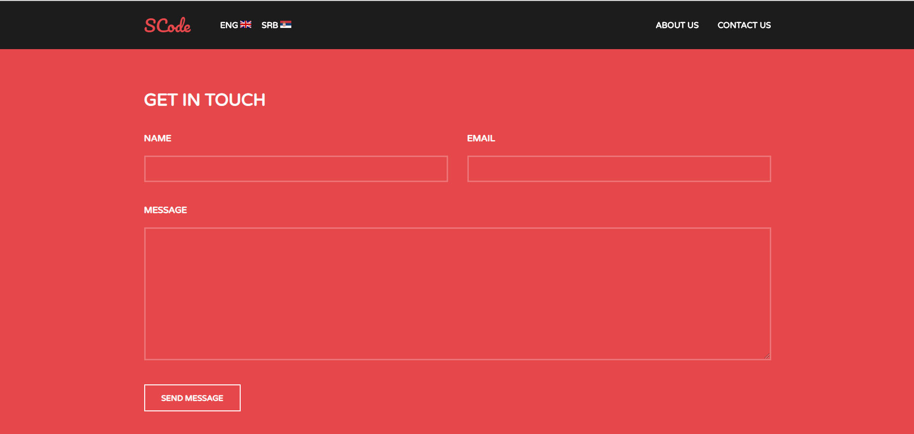

# Umbraco Application for Web development Agency

Simple Web application built with Umbraco 8. Main features are content management in two languages and contact form logic which uses Gmail SMTP for sending out e-mails.

## Screenshots of application - English
 
 
 

## Screenshots of application - Serbian
 
 
 

## Screenshots of application - Umbraco Admin
 
 
 

## Getting Started

These instructions will get you a copy of the project up and running on your local machine for development and testing purposes.

### Prerequisites

- [.NET Framework](https://dotnet.microsoft.com/download/dotnet-framework/)
- [Microsoft SQL Server Express](https://www.microsoft.com/en-us/sql-server/sql-server-editions-express)
- [Visual Studio IDE](https://visualstudio.microsoft.com/vs/)

### Installing Backend

1. Open .sln file using Visual Studio IDE
2. Build the solution to install dependencies
3. Database connection string can be updated in Web.config file
5. Run the application
6. Set up Umbraco
 
## Built With

* [.NET Framework](https://dotnet.microsoft.com/download/dotnet-framework/)
* [Umbraco 8](https://our.umbraco.com/download/)

## Authors

[Slobodan Cvetković](https://github.com/slobodanc93)
